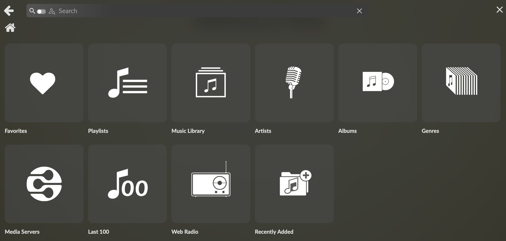
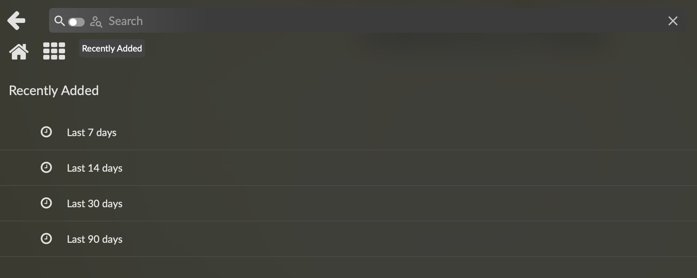
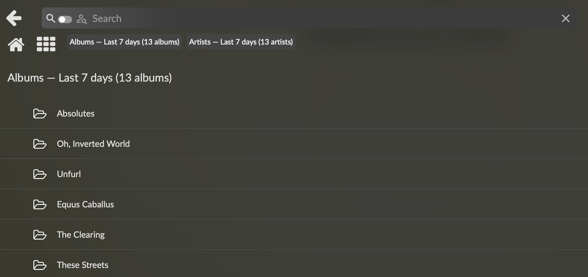
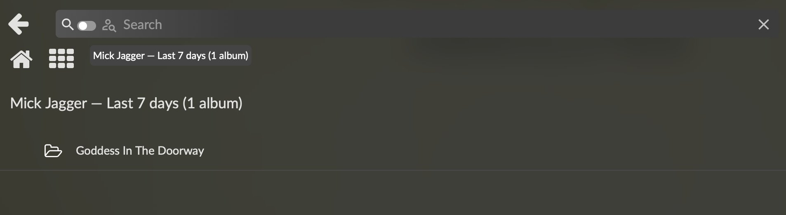

# Recently Added Plugin for Volumio – v0.4.1

> **⚠️ Disclaimer**
>
> This plugin was developed with the assistance of AI (Claude by Anthropic). While it has been tested on real hardware and is functional, it is provided as-is without warranty. Use at your own risk. The author assumes no responsibility for any damage to your hardware, software, or data. Always back up your Volumio configuration before installing third-party plugins.

Adds a "Recently Added" entry to Volumio's Browse menu showing albums and artists added to your local music library within configurable time windows.  Reads directly from MPD's database — no separate index, no filesystem watcher, no native modules.

---

## Features

- **Time-windowed browse:** four windows out of the box — Last 7 / 14 / 30 / 90 days
- **Configurable view modes:** Albums only / Artists only / Both (default)
- **Artist drill-down:** tap an artist to see only their recently-added albums in the selected window
- **AlbumArtist grouping:** compilations stay together even when per-track Artist values differ
- **Album-tag titles:** album entries show the embedded `Album` tag (with folder-name fallback for untagged music)
- **Album cover artwork:** tiles use Volumio's standard albumart resolution, with fallback icons when no cover exists
- **Native multilingual UI:** English, German, French, Italian, Spanish, Dutch, Polish — picked up automatically from Volumio's language setting
- **Zero database overhead:** stateless reads against MPD's existing tag cache; no SD-card writes, no watcher state
- **Always in sync with Volumio:** because we read what MPD reads, every visible album is by construction browsable; the standard "Update Library" workflow makes new music appear here too

### Screen Previews

**Browse tile**



**Time-window list (root)**



**Albums + Artists section view**



**Artist drill-down**



---

## Changelog

### v0.4.1

**Refinements:**

1. **Tile name translates with the UI.**  Previously the "Recently Added" tile label was the same in every language; now it follows Volumio's `language_code`: *Kürzlich hinzugefügt* (DE), *Ajouts récents* (FR), *Aggiunti di recente* (IT), *Añadidos recientemente* (ES), *Recent toegevoegd* (NL), *Ostatnio dodane* (PL).  Note that Volumio registers the tile name once at plugin start, so changing the UI language requires a plugin restart (or reboot) for the tile to update — the breadcrumb and list titles update immediately on each browse.

2. **README screenshots bundled.**  `docs/images/{tile,windows,sections,artist}.png` are now part of the plugin tarball.

### v0.4.0

**New feature:**

1. **Multilingual UI.**  Six new translations added: German, French, Italian, Spanish, Dutch, Polish (matching the language set of the OLED plugin).  All user-visible strings — settings page, browse section headers, plural counts, artist drill-down titles, error messages, toast notifications — are translated.  Languages are picked up automatically from Volumio's `language_code` shared variable; falls back to English if a translation file is missing or a key is unresolved.  Bundled English strings remain canonical and define the key set.

2. **README documentation.**  This file.

### v0.3.4

**Code review pass — connection resilience, cleanup, i18n preparation.**

1. **MPD client socket-leak fixes.**  Pre-ready errors and connect timeouts no longer leave orphan TCP sockets behind.  A new `safeDisconnect()` helper is called on every error path; late `'ready'` events that arrive after a timeout self-disconnect instead of being silently dropped.  Query timeouts now also force a fresh socket on the next call rather than reusing a suspect one.

2. **Cleaner error UX.**  When MPD is unreachable, the user now sees a single non-clickable status line (`type: 'item-no-menu'`, no URI) with a localized message — no more raw `Error: connect ECONNREFUSED 127.0.0.1:6600` dumps in browse titles, no possibility of bouncing into a navigation loop on a broken connection.

3. **Album titles use the Album tag.**  Where previously album entries displayed the parent folder name (e.g. `[24bit] Pink Floyd - The Wall`), they now display the embedded `Album` tag (`The Wall`).  The tag value is selected as the most-common Album tag across the album's tracks, which is robust against sloppy tagging where one stray track has a different value.  Falls back to the folder name when no track in the bucket has an Album tag.

4. **All hardcoded English strings replaced with translation keys.**  Window titles ("Last 7 days"), section headers ("Albums — Last 30 days (5 albums)"), error window titles, and toast notifications now resolve through a new runtime `_t()` helper.  Plural-aware via separate `*_ONE` / `*_MANY` keys.  Sets up cleanly for the v0.4.0 translations pass.

5. **Pure-logic helpers extracted to `lib/grouping.js`.**  `artistOf`, `albumTitleOf`, and `groupByAlbum` moved out of the controller into a dependency-free module that can be exercised from a smoke test.  102 lines, zero `this`, no Volumio APIs touched.

6. **Logging discipline.**  Per-browse INFO chatter dropped to `debug` (URI received, result count, MPD connection-closed events).  INFO level retained for actual state transitions (start, stop, MPD connected, config save, icon presence).

7. **Other cleanups.**  `boot_priority` lowered from 5 to 10 (we don't need to start early); architectures broadened to `armhf, arm64, amd64, i386` (no native deps means no platform restriction); SIGTERM handler restored for tidy MPD disconnect on shutdown; dead `_stopped` flag removed; `PLUGIN_URI` and `PKG_VERSION` extracted to module-level constants; `explodeUri`/`search` no-op stubs documented.

### v0.3.3

**Refinement:**

1. **Tile icon recentered.**  Adjusted glyph position so the visual weight sits closer to the centre of the 500×500 canvas.

### v0.3.2

**Refinement:**

1. **Tile icon resized to 500×500.**  Matches the canvas size of Volumio's stock tiles for consistent rendering at all display sizes.

### v0.3.1

**Refinement:**

1. **Tile icon converted to luminance-based alpha.**  The tile artwork is now pure white where visible and fully transparent elsewhere — antialiased grey edges from the source image become semi-transparent white, which composites cleanly over Volumio's dark theme without halos or background artefacts.  Lanczos downsample for clean edges at typical display sizes.

### v0.3.0

**New features:**

1. **Configurable view mode.**  New `view_mode` setting in the Display section: *Albums only* / *Artists only* / *Albums and Artists* (default Both).  In Both mode, browsing a time window returns two stacked Volumio sections in one screen — albums on top, artists below — matching Volumio's home-page pattern.

2. **Artist drill-down.**  Tapping an artist tile in the Artists section opens a filtered view showing only that artist's recently-added albums in the same time window (not their entire discography).  Re-uses the parent window's MPD query and filters in-memory by AlbumArtist (with Artist fallback).

3. **AlbumArtist grouping.**  Artist buckets are keyed on the `AlbumArtist` tag (fallback `Artist`, then literal `"Unknown Artist"`).  Compilations with per-track Artist values but a single AlbumArtist (e.g. "Various Artists") group together as one entry, matching user expectation.

4. **Refined tile icon.**  Library + plus badge with anti-aliased edges; replaces the earlier clock-only design.

### v0.2.0

**Architectural rewrite — read directly from MPD's database.**

Earlier v0.1.x revisions maintained a separate SQLite index of file first-seen timestamps, populated by an initial scan plus a chokidar filesystem watcher.  The watcher could index files faster than MPD's own database catch-up, producing "phantom" album entries whose contents failed to open from the Recently Added view because MPD didn't yet know about them.  The natural fix would have been to auto-trigger MPD rescans, but that conflicts with users (deliberately) controlling when the library is updated.

v0.2.0 takes the opposite approach: MPD already maintains a database of every audio file with its `Last-Modified` timestamp, so we just query it directly via `find modified-since "<ISO>"` and group results in memory.  This eliminates `better-sqlite3` (native compile gone), `chokidar` (no watcher), the initial scan, all SD-card writes, and the entire phantom-entry problem class — by construction every album we surface is browsable in MPD.  The plugin is now stateless, ~870 lines total instead of ~1400, and installs in under a second.

### v0.1.0–v0.1.2

Initial SQLite + watcher implementation.  Works in principle but suffers the synchronization problem described above.  Superseded by v0.2.0.

---

## Installation Guide

### Prerequisites

- Volumio running on any supported hardware (Raspberry Pi, x86, etc.)
- A populated local music library (the plugin queries MPD, so MPD must have indexed your music — visible in Volumio under Browse → Music Library)
- SSH enabled in Volumio (Settings → Network → SSH)

### Step-by-step

```bash
# 1. SSH into your Volumio
ssh volumio@volumio.local
# password: volumio

# 2. Create the plugin directory
mkdir -p /data/plugins/music_service/recently_added

# 3. Transfer the tarball (run this on your PC, not the Pi)
scp recently_added-v0.4.1.tar volumio@volumio.local:/tmp/

# 4. Extract on the Pi
cd /data/plugins/music_service
tar xf /tmp/recently_added-v0.4.1.tar

# 5. Run the installer
cd /data/plugins/music_service/recently_added
chmod +x install.sh uninstall.sh
bash install.sh

# 6. Reboot to register the plugin
sudo reboot
```

### After reboot

1. Open Volumio's web UI
2. Go to **Plugins → Installed Plugins**
3. Find **Recently Added**
4. Toggle the slider to **enable**
5. Optionally click **Settings** to change the view mode or MPD connection details

Open the Browse tab — a new "Recently Added" tile appears alongside Albums, Artists, etc.

> **Do NOT manually edit plugins.json.** Volumio discovers and registers
> the plugin automatically when it finds the directory at boot.

---

## Configuration Options

| Setting | Default | Description |
|---------|---------|-------------|
| View Mode | Albums and Artists | What to show when tapping a time window: Albums only / Artists only / Both |
| MPD Host | localhost | Hostname or IP of the MPD server (use `localhost` for Volumio's local MPD) |
| MPD Port | 6600 | TCP port of the MPD server (Volumio default) |
| Query Timeout | 10000 ms | Max wait for an MPD `find` query before giving up — increase for very large libraries |

The four time windows (7 / 14 / 30 / 90 days) are fixed by design.  If you want to add or remove windows, edit the `windows` array in `_buildRootList()` in `index.js` and add matching `BROWSE.WINDOW_<n>D` keys to the i18n files.

---

## Troubleshooting

### Plugin doesn't appear in the UI after reboot

```bash
# Verify the directory structure is correct
ls /data/plugins/music_service/recently_added/package.json
# Must exist.  If not, the directory path is wrong.

# Check Volumio sees it
cat /data/configuration/plugins.json | python3 -m json.tool | grep recently
```

### Tile loads but tapping a window shows "MPD not reachable"

```bash
# Is MPD running?
sudo systemctl status mpd

# Can MPD be reached on its socket?
echo -e 'status\nclose' | nc localhost 6600
# Should return "OK MPD <version>" then status fields

# Plugin logs
journalctl -u volumio -f | grep RecentlyAdded
```

If MPD isn't running, restart it: `sudo systemctl restart mpd`.

### Albums show but tapping one returns an empty list

This means MPD's database hasn't indexed those tracks yet.  In Volumio's web UI, go to **Settings → Music Library → Update** (or click the refresh icon next to your library source) and wait for the toast confirming the scan finished.  This was a known issue in v0.1.x and is structurally impossible in v0.2.0+ — if you see it, you may be running an old version.

### Album titles look wrong / show folder names instead of the Album tag

The plugin uses the embedded `Album` tag when present.  If a folder's tracks lack an Album tag (or have inconsistent ones), the title falls back to the folder name.  Re-tag the affected files (e.g. with Mp3tag, Picard, or Kid3) and run a Volumio library update.

### "mpd module failed to load" at install

```bash
cd /data/plugins/music_service/recently_added
npm install --production
# Then disable and re-enable the plugin in the web UI
```

The `mpd` package is pure JavaScript — there's no native compile, so this should rarely fail.  If it does, check that npm itself works on the Pi (`npm --version`).

---

## File Structure

```
recently_added/
├── package.json         npm + Volumio plugin metadata
├── config.json          default configuration values (v-conf wrapped)
├── UIConfig.json        settings page schema for Volumio web UI
├── icon.png             tile icon (500×500, white-on-transparent)
├── index.js             plugin lifecycle, browse handlers, i18n helpers
├── install.sh           installs npm deps, verifies the mpd module loads
├── uninstall.sh         cleanup
├── i18n/
│   ├── strings_en.json  canonical key set
│   ├── strings_de.json
│   ├── strings_es.json
│   ├── strings_fr.json
│   ├── strings_it.json
│   ├── strings_nl.json
│   └── strings_pl.json
└── lib/
    ├── grouping.js      pure helpers: artistOf, albumTitleOf, groupByAlbum
    └── mpd-client.js    TCP client wrapper around the `mpd` npm package
```

---

## Architecture

```
                          Volumio Browse UI
                                  │
                                  │ browse tap
                                  ▼
            ┌───────────────────────────────────────┐
            │  index.js (ControllerRecentlyAdded)   │
            │   handleBrowseUri → _buildWindowList  │
            └───────────────────────────────────────┘
                                  │
                       ┌──────────┴──────────┐
                       │                     │
                       ▼                     ▼
            ┌─────────────────┐   ┌──────────────────────┐
            │ lib/mpd-client  │   │ lib/grouping         │
            │ findModifiedSince│   │ groupByAlbum         │
            └─────────────────┘   │ albumTitleOf         │
                       │          │ artistOf             │
                       │          └──────────────────────┘
                       │ TCP                  ▲
                       │ find modified-since   │
                       ▼                       │
            ┌─────────────────┐                │
            │   MPD daemon    │                │
            │  (tag cache)    │                │
            └─────────────────┘                │
                       │                       │
                       │ entries[]             │
                       └───────────────────────┘
```

The plugin owns no persistent state.  Every browse request fires one (sometimes two, on artist drill-down) `find modified-since` query to MPD and groups the result in memory.  MPD's tag cache makes the query fast — typically 10–50 ms for libraries of several thousand files — so caching on our side would buy little and add invalidation complexity.

Albums are presented as `music-library/<path>` URIs which Volumio's MPD controller handles natively, so playback, queue, and artwork resolution all flow through Volumio's existing code paths with no duplication on our end.
